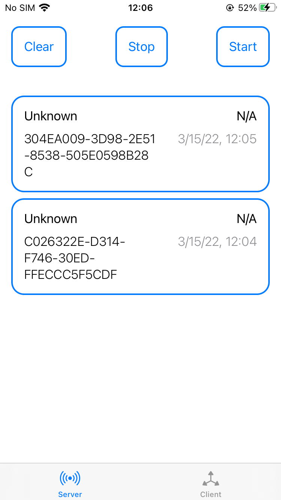
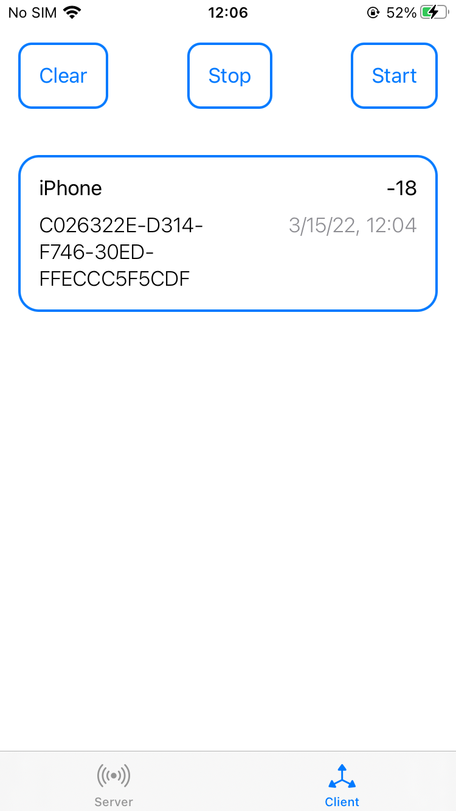

# NearbyBLE-iOS
iOS app that exchange SHA-256 token using BLE

Personal exercise to get familiar with of Core Bluetooth, Core Data and SwiftUI

# Description
The gatt server serves on a particular UUID; there are 2 characteristics: one to server the server token which is read-only, and another for the client to write its token.
The new found devices are saved in a local database and displayed in two tabs. 

## Screenshots

  
   

